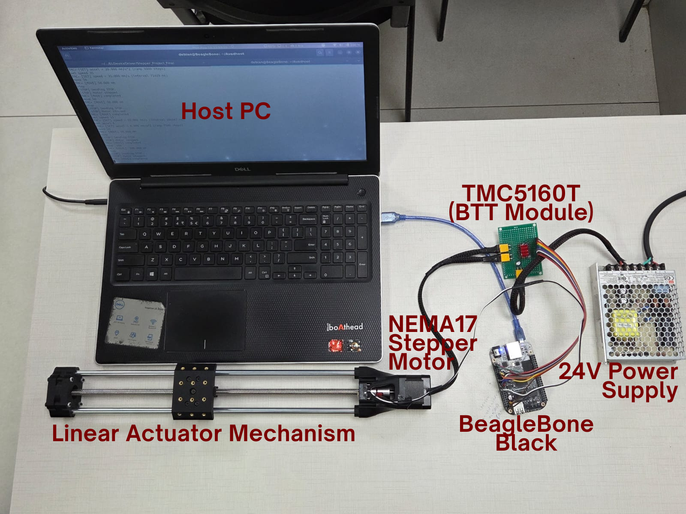

# TMC5160 SPI+GPIO Linux Device Driver for Stepper Motor Control

> CDAC PG-Certificate in Embedded Systems Design — Final Project

## Overview

This project builds a Linux kernel character device driver for the Trinamic TMC5160 stepper motor controller, running on a BeagleBone Black. SPI configures the chip and reads status; GPIO lines carry STEP/DIR pulses for motion and DIAG lines report faults and stalls. The driver exposes `/dev/tmc5160`, so a userspace application can command angle, speed, and acceleration without touching TMC5160 registers directly.

A second, independent driver watches a limit switch at the actuator's home position and exposes `/dev/homesw`. Userspace combines both devices — plus a 3D-printed screw-based mechanism — into a working linear actuator that can move to a position in millimeters and home itself.

## System Architecture

```
                      ┌─────────────────────────┐
                      │  user_app (userspace)   │
                      │  mm → angle conversion  │
                      └───────────┬─────────────┘
                     ioctl/write  │  poll
              ┌────────────────── ┴ ──────────────────┐
              │                                       │
      /dev/tmc5160                              /dev/homesw
              │                                       │
   ┌──────────┴──────────┐                 ┌──────────┴──────────┐
   │  tmc5160_drv.ko     │                 │    homesw driver    │
   │  tmc5160_cdev.c     │                 │  GPIO edge IRQ on   │
   │  tmc5160_motion.c   │ hrtimer         │    limit switch     │
   │  tmc5160_hw.c       │ SPI + GPIO      └──────────┬──────────┘
   └──────────┬──────────┘                            │
              │ SPI0, STEP/DIR/EN, DIAG0/1            │
   ┌──────────┴─────────────────────────────┐         │
   │      TMC5160 (BTT breakout board)      │         │
   └──────────────┬─────────────────────────┘         │
                  │                                   │
          ┌───────┴────────┐                  ┌───────┴────────┐
          │ NEMA17 stepper │──── lead screw ──│  home switch   │
          │                │     moves        │  at travel end │
          └────────────────┘     platform     └────────────────┘
```

The two drivers have no kernel-level link — coordination happens only in `user_app`, which runs one thread driving the actuator via `/dev/tmc5160` and another polling `/dev/homesw` to stop the motor when the switch trips.

## Hardware

| Component | Details |
| --- | --- |
| Single board computer | BeagleBone Black (AM335x, ARM Cortex-A8) |
| Motion controller IC | Trinamic TMC5160 (BTT TMC5160 Pro V1.0 breakout) |
| Validation MCU | STM32F407G-DISC1 |
| Stepper motor | FL42STH38-1684A, NEMA17, 200 steps/rev, 1.68 A/phase |
| Limit switch | Snap-action switch at the actuator home position |
| Lead screw & nut | 400 mm length, 8 mm pitch |
| Linear guides | 2 cylindrical rods, 1 linear bearing per rod, axial bearing on the screw's far end |
| Actuator body | 3D-printed ABS, 6 parts, designed in Fusion 360 |
| Power supply | 24 V, 108 W DC |



## Tech Stack

- Embedded Linux kernel module development, kernel 5.10.168-ti-r83
- Linux SPI subsystem (`spi_driver`, `spi_sync()`, 40-bit datagrams)
- Linux GPIO descriptor API for STEP/DIR/ENABLE and the home switch input
- Linux IRQ subsystem — DIAG0/DIAG1 and the home switch GPIO edge interrupt
- hrtimer for STEP pulse generation and the velocity ramp
- Device Tree overlays for the TMC5160 and the home switch
- STM32 HAL for Stage 1 bare-metal validation
- Fusion 360 + 3D printing for the actuator mechanism

## Team

| Name | Email |
| --- | --- |
| Sanyam Choraria | sanyam1802@gmail.com |
| Joshi Avadhoot Kiran | avadhoot.joshi2402@gmail.com |
| Mande Swanand Suhas | mandeswanand7@gmail.com |
| Ganesh Ashok Patil | patilganesh413517@gmail.com |

## Project Stages

### Stage 1 — Bare Metal Validation (STM32F407)

Before writing any Linux driver code, the STM32F407G-DISC1 acts as SPI master to confirm the hardware works: SPI communication with the TMC5160, GPIO STEP/DIR motion, and stall detection via the DIAG interrupt pin, with status reported over UART.

### Stage 2 — TMC5160 Linux Driver (BeagleBone Black)

The core kernel module, `tmc5160_drv.ko`, replaces the STM32 from Stage 1. It registers as an SPI device via the Device Tree, exposes `/dev/tmc5160`, and uses an hrtimer to generate STEP pulses and run the velocity ramp. A GPIO interrupt handler on DIAG0/DIAG1 reports faults and stalls; sysfs attributes expose motor state.

Since SD_MODE is tied to logic 1 on the breakout board, the TMC5160's internal SPI ramp generator stays off — motion runs purely on STEP/DIR pulses, with position tracked by a software step counter.

### Stage 3 — Linear Actuator Application

This stage adds the home switch driver and the physical actuator, then ties everything together in userspace.

- `homeswdrv/` — `homesw.c`/`homesw.h`, a GPIO edge-interrupt driver exposing `/dev/homesw`, independent of the TMC5160 driver
- `tmc5160drv/` — the TMC5160 driver, same source as Stage 2
- `linear_actuator.dts` — combined Device Tree overlay for both drivers
- `user_app.c` / `userspace.h` — converts a target displacement in centimeters to a motor angle using the lead screw pitch, sends it to `/dev/tmc5160`, and runs the two-thread homing routine described above
- `mechanicalhw/` — the 3D-printed actuator mechanism: `actuator_mech.f3d` (Fusion 360 source, 6 printed parts), `actuator_mech.png` (render), and `mechanicalhw_desc.md` (parts list)

**Final deliverable:** TMC5160 driver and home switch driver, together controlling a screw-based linear actuator, with a userspace control application.

## Repository Structure

```
.
├── stage1_stm32               # STM32 bare metal firmware (CubeIDE project)
├── stage2_driver              # TMC5160 kernel driver source
│   ├── tmc5160_hw.c
│   ├── tmc5160_motion.c
│   ├── tmc5160_cdev.c
│   ├── tmc5160_main.c
│   ├── tmc5160.h
│   └── Makefile
├── stage3_application         # linear actuator control application
│   ├── homeswdrv/
│   │   ├── homesw.c
│   │   ├── homesw.h
│   │   └── Makefile
│   ├── tmc5160drv/            # same source as stage2_driver
│   ├── mechanicalhw/          # 3D-printed actuator mechanism
│   │   ├── actuator_mech.f3d
│   │   ├── actuator_mech.png
│   │   └── mechanicalhw_desc.md
│   ├── linear_actuator.dts    # combined Device Tree overlay
│   ├── user_app.c
│   └── userspace.h
├── refdocs                    # reference documents and datasheets
├── hardware_setup.png         # labeled image of final setup
└── README.md
```

## Current Status

- [x] Stage 1 — Complete
- [x] Stage 2 — Complete
- [x] Stage 3 — Complete
